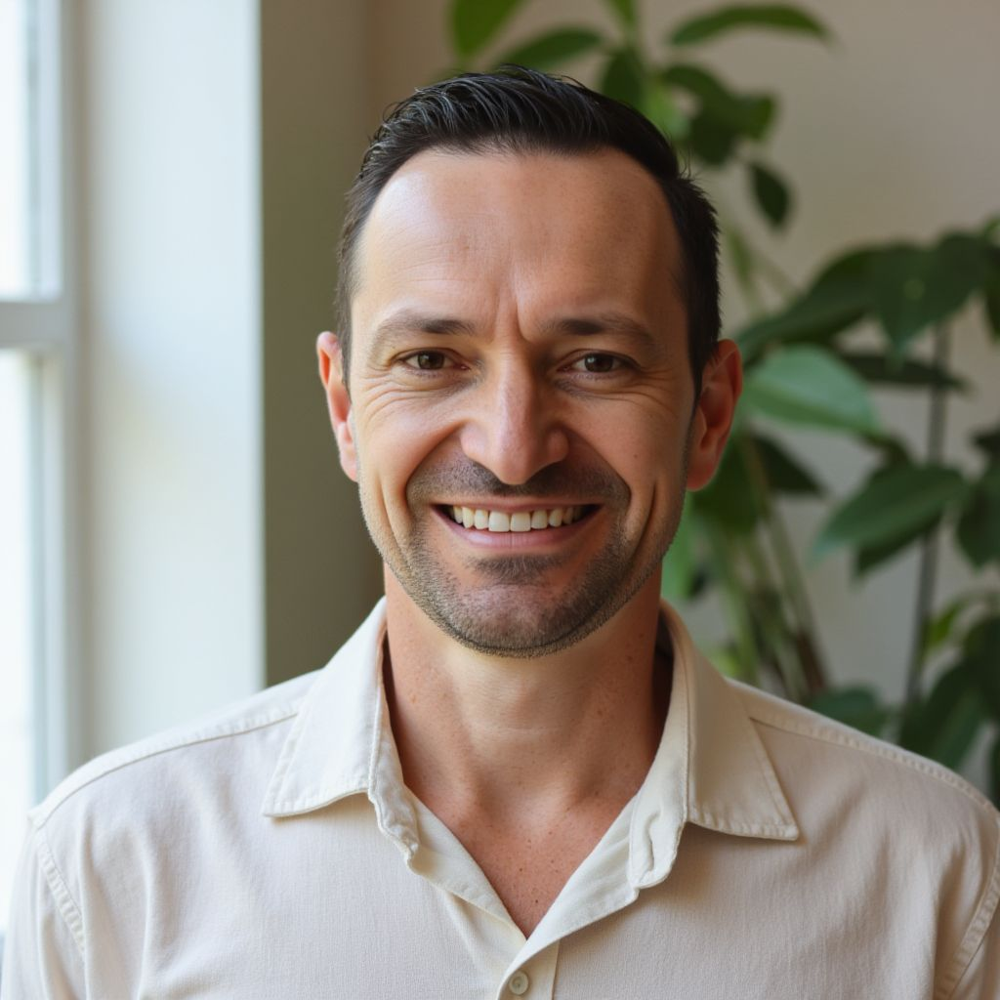

<html lang="pt-BR">
<head>
<meta charset="utf-8"/>
<meta name="viewport" content="width=device-width,initial-scale=1"/>
<title>Antes de virar o ano — quero estar em paz comigo | Workshop</title>
<link href="https://fonts.googleapis.com/css2?family=Playfair+Display:wght@600;700;800&family=Inter:wght@300;400;600;700&display=swap" rel="stylesheet">

</head>
<body>

  <!-- FAIXA WORKSHOP fixada full-bleed no topo -->
  

    <h2>WORKSHOP</h2>
  

  <!-- espaçador para empurrar conteúdo -->
  

  

    <!-- HERO -->
    <main class="hero" role="main" aria-labelledby="hero-title">
      <h1 id="hero-title">Antes de virar o ano, quero estar em paz comigo.</h1>
      

      
 Dias 2, 3 e 4 de dezembro • às 20h — três noites para encerrar 2025 com leveza, soltar o que pesa e se reencontrar consigo mesma antes de entrar em 2026.

    </main>

    <!-- AS TRÊS NOITES -->
    <section id="noites" aria-labelledby="noites-title">
      

      <h2 id="noites-title" class="section-title">As três noites</h2>

      

        <article class="card"><h3>🌙 1ª Noite — O peso que ainda carrego</h3>
Reconheça o que está tirando sua paz: mágoas, culpas e cobranças que já não cabem mais. Nomear para começar a libertar.
</article>
        <article class="card"><h3>💚 2ª Noite — Quando soltar é cuidar</h3>
Exercícios práticos para soltar o controle, acolher limites e aprender que cuidar também é pausar.
</article>
        <article class="card"><h3>✨ 3ª Noite — O recomeço que nasce da paz</h3>
Ritual de encerramento: transformar o vivido em sabedoria e definir intenções para 2026.
</article>
      

    </section>

    <!-- OBJETIVOS -->
    <section id="objetivos" aria-labelledby="obj-title">
      

      <h2 id="obj-title" class="section-title">Objetivos do Workshop</h2>

      

        
<h3>Reconhecer o que pesa</h3>
Identificar emoções e padrões que atrapalham sua paz.

        
<h3>Aprender a soltar</h3>
Ferramentas práticas para libertar ansiedade, culpa e cobranças.

        
<h3>Recomeçar com intenção</h3>
Definir ações e intenções suaves para entrar em 2026 com mais clareza e leveza.

      

    </section>

    <!-- PARA QUEM -->
    <section id="para-quem" aria-labelledby="who-title">
      

      <h2 id="who-title" class="section-title">Para quem é / Para quem não é</h2>

      

        
<h4>Para quem é</h4>
          <ul>
            <li>Pessoas que querem fechar o ano com clareza emocional e leveza.</li>
            <li>Quem busca um processo guiado, humano e prático.</li>
            <li>Quem está disposto(a) a reservar ~1h nas três noites e participar ativamente.</li>
            <li>Pessoas abertas a práticas de introspecção e rituais de encerramento.</li>
          </ul>
        

        
<h4>Para quem não é</h4>
          <ul>
            <li>Quem procura fórmulas mágicas sem envolvimento pessoal.</li>
            <li>Quem não pode ou não quer reservar ~1h nas três noites.</li>
            <li>Quem não quer olhar para emoções ou sentir para compreender.</li>
          </ul>
        

      

    </section>

    <!-- MENTOR -->
    <section id="mentor" aria-labelledby="mentor-title">
      

      <h2 id="mentor-title" class="section-title">Conheça seu mentor</h2>

      

        
        

          <h3>Evandro Favoretto</h3>
          
Graduado em Gestão Financeira, pós-graduado em Neurociência, Psicologia e Saúde Mental. Formação em Constelação Familiar e Empresarial, numerologia, respiração terapêutica e meditação. Empresário, consultor e mentor de vida.

        

      

    </section>

    <!-- FAQ — TODOS os itens (abrir/fechar) -->
    <section id="faq" aria-labelledby="faq-title">
      

      <h2 id="faq-title" class="section-title">Perguntas Frequentes</h2>

      

        
<h4>Preciso participar das três noites?</h4>
Recomendamos acompanhar o ciclo completo, mas é possível participar de noites isoladas. A experiência completa vem com o ciclo inteiro.

        
<h4>O que vou vivenciar em cada noite?</h4>
1ª noite: reconhecimento das feridas e pesos. 2ª noite: práticas de soltura e autocuidado. 3ª noite: ritual de encerramento e definição de intenções.

        
<h4>É online e haverá gravação?</h4>
O evento é online. Gravações podem ser disponibilizadas por tempo limitado — inscreva-se para receber o link.

        
<h4>Como garanto minha vaga?</h4>
Ao entrar no grupo de WhatsApp você receberá instruções, links e lembretes antes de cada encontro.

        
<h4>Preciso participar ao vivo?</h4>
Participar ao vivo é recomendado para vivências e trocas; gravações ajudam quem não puder assistir.

        
<h4>É cobrado algum valor?</h4>
Não — o workshop é 100% gratuito.

        
<h4>Tenho dúvidas ou preciso de suporte</h4>
Suporte via grupo do WhatsApp. Envie sua dúvida no grupo e a equipe irá orientar.

      

    </section>

  
 <!-- .wrap -->

  <!-- footer full-bleed azul forte -->
  
© 2025 — Todos os direitos reservados a Workshop: Antes de virar o ano, quero estar em paz comigo mesmo.”

  <!-- floating countdown + whatsapp (tamanho fixo; seguem rolagem sem alterar tamanho) -->
  

    
Próximo encontro

    
--d — --:--:--

    
02 Dez • 20h

  

  <button class="whatsapp-float" id="whatsBtn" onclick="openGroup()" style="top:220px" aria-label="Entrar no grupo">Entrar no grupo</button>

</body>
</html>
